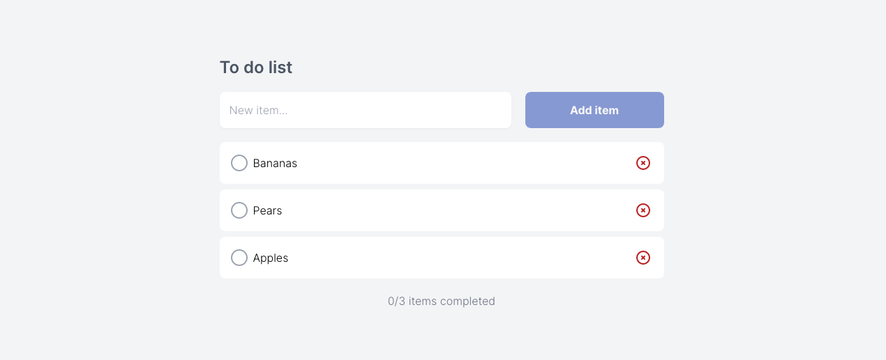

# To do list

To do list app built with [Vue.js](https://www.google.com/url?sa=t&rct=j&q=&esrc=s&source=web&cd=&cad=rja&uact=8&ved=2ahUKEwj-qP65mcfyAhVjQkEAHcRtDeMQFnoECAYQAw&url=https%3A%2F%2Fvuejs.org%2F&usg=AOvVaw06q0bfK8Y9QAOb2C8cD5Qh), [Apollo](https://apollo.vuejs.org/), [Hasura](https://hasura.io/) and [Tailwind](https://tailwindcss.com/).

## Features

- Add items
- Remove items
- Mark items complete
- Sort completed items
- Display number of completed items

## UX objectives

1. Clean and simple user interface
2. Save and retrieve data automatically
3. Helpful user interactions, for example:
   - A loading indicator when waiting
   - Moving completed items to the bottom

## Screenshot



## Requirements

- [Node.js](https://nodejs.org/)
- [Node Package Manager (npm)](https://www.npmjs.com/)
- GraphQL endpoint, e.g. [Hasura](https://hasura.io/)
- Database, e.g. [Heroku](https://hasura.io/docs/latest/graphql/cloud/projects/create.html#new-database)

## Getting started

Clone the repository

```
git clone https://github.com/tarpey/todo-vue
```

Install the dependencies

```
yarn install
```

Create a file to store local environment variables

```
touch .env.local
```

Add GraphQL endpoint and Hasura key

```
VUE_APP_GRAPHQL_HTTP=XXX
VUE_APP_HASURA_ADMIN_SECRET=XXX
```

Run the development server

```
yarn serve
```

### Compile and minify for production

```
yarn build
```
